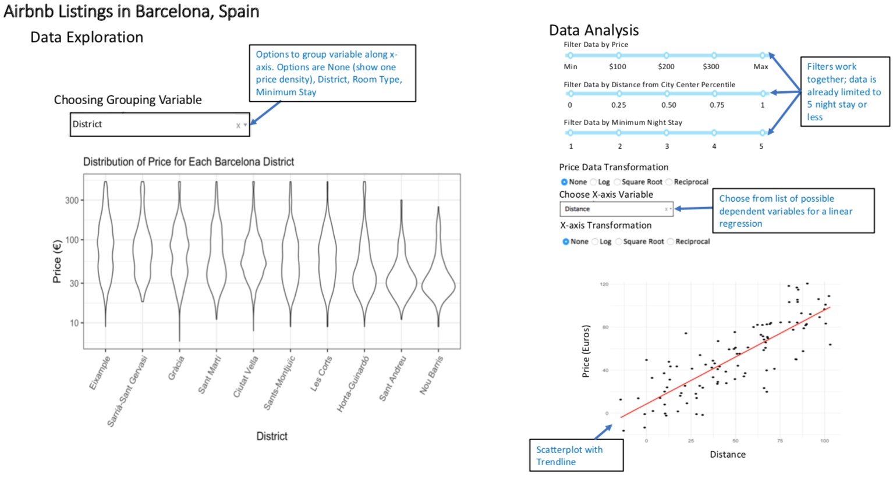

# Group 09
Repository for Kristina Wright and Daniel Hadley group project for [STAT 547M](https://stat545.stat.ubc.ca/)

## 1. About This Repository :information_source:
> This repository houses Group 09's project for STAT 547M taken in Term 2 of the 2019-2020 academic here.
>
> Our project uses an Airbnb dataset to try and find significant factors to explain the listing prices (per night) in Barcelona, Spain.
>
> The final report is created by meeting milestones which are linked below.

## 2. Navigating the Repository :file_folder:
> As milestones are met, files are placed into the appropriate subfolders. 

1. The [data](https://github.com/hadleyd2/group_09-1/tree/master/data) folder contains all datasets used throughout the project.
1. The [docs](https://github.com/hadleyd2/group_09-1/tree/master/docs) folder contains all `*.Rmd` files used to create reports.
1. The [images](https://github.com/hadleyd2/group_09-1/tree/master/images) folder saves all images produced for the group project.
1. The [scripts](https://github.com/hadleyd2/group_09-1/tree/master/scripts) folder saves all `R` scripts (`*.r`) that are called when rendering the project.
1. The [tests](https://github.com/hadleyd2/group_09-1/tree/master/tests) folder contains all tests carried out when producing the analysis.

| Milestone | Due Date :date: | Report
| :--: | ---- | :--------------: |
| [01](https://stat545.stat.ubc.ca/evaluation/milestone_01/milestone_01/) | February 29, 2020 | [milestone01](https://hadleyd2.github.io/group_09-1/docs/milestone01/milestone01.html) |
| [02](https://stat545.stat.ubc.ca/evaluation/milestone_02/milestone_02/) | March 7, 2020 | [milestone02](https://hadleyd2.github.io/group_09-1/docs/milestone02/milestone02.html) |
| [03](https://stat545.stat.ubc.ca/evaluation/milestone_03/milestone_03/) | March 14, 2020 | [html](https://hadleyd2.github.io/group_09-1/docs/final_report.html) and [pdf](https://hadleyd2.github.io/group_09-1/docs/final_report.pdf) |

## 3. Usage :computer:

1. Clone this repo.

1. Ensure the following `R` packages are installed:

    - `tidyverse`
    - `here`
    - `docopt`
    - `knitr`
    - `DT`
    - `gridExtra`
    - `corrplot`
    - `glue`
    - `scales`
    - `broom`
  
1. Option 1: Run the following scripts (in order) in terminal from the main repo directory with the specified arguments:

    a) **Load data**
    `Rscript scripts/load.R --data_url=https://raw.githubusercontent.com/STAT547-UBC-2019-20/data_sets/master/listings-Barcelona.csv`
  
    b) **Clean data**
    `Rscript scripts/process.R --path_raw=data/raw_listings.csv --path_clean=data/clean_listings.csv`
  
    c) **Exploratory data analysis**
    `Rscript scripts/EDA.R --path_clean=data/clean_listings.csv --path_image=images/`
    
    d) **Linear Regression**
    `Rscript scripts/lm.R --path_data=data/clean_listings.csv`
  
    e) **Knit final report**
    `Rscript scripts/knit.R --final_report="docs/final_report.Rmd"`

1. Option 2: Run make in terminal from the main repo directory to run all individual scripts above:

    a) **Dependency**
    Ensure `make` is installed
    
    b) **Run all scripts and reproduce analysis**
    `make all`
    
    c) **Delete all output from scripts**
    `make clean`
    
## 4. Dashboard Proposal

### Dashboard Description

This app will have features for data exploration and data analysis. Data exploration presents a density of Airbnb listing prices for Barcelona, Spain and allows the user to select a categorical variable to view a violin plot. The default shows the density for all listing prices with no groupings. The grouping options will be District, Room Type, or Minimum Night Stay.

For the data analysis, users can filter the dataset using any combination of three filters for price, distance from city center, or minimum night stay. Then, a simple linear regression is run using an independent variable (x-axis variable) chosen by the user and price as the dependent variable. Price and the independent variable can then be transformed using logarithms, square root, or reciprocal. The transformations may improve the linear relationship. Once the selections have been made, a scatterplot with the linear regression line is presented.

### Usage Scenarios

Maria lives in Barcelona and wants to rent out her apartment as she travels over the next two weeks. She decides to use Airbnb.com, and her friend has offered to manage the rental process while she is away. Maria wants to choose a listing price that is competitive, but does not want to list too low. She knows her apartment is in a very desirable neighourhood for tourists. In order to select her price, she wants to be able to compare her apartment to similar Airbnb listings and write a description that emphasizes those characteristics most strongly related to higher listing prices. Maria visits our dashboard and uses the data exploration section to see the distribution of listing prices for her neighborhood. To eliminate extremely low/high prices, she uses the filters in our data analysis section. She selects an x-axis variable and uses the scatterplot and trendline to see the mean listing price for Airbnb listings with a similar characteristics. She does this for a few variables to get an idea of the most important characteristics to stress in her listing's description. Then using the most important characteristics, she approximates a good listing price.

### Dashboard Sketch

